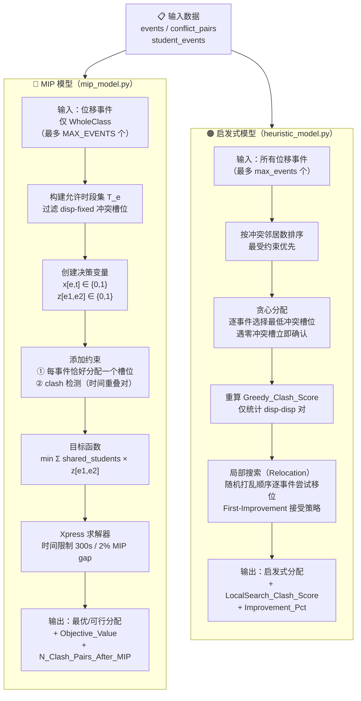

# 指标说明文档

> 本文档说明项目中所有模块（基线分析、启发式模型、MIP 模型）使用的量化指标的定义、计算方式及解读方法。

---

## 目录

1. [位移事件指标](#1-位移事件指标)
2. [冲突（Clash）指标](#2-冲突clash指标)
3. [午餐时段可用性指标](#3-午餐时段可用性指标)
4. [教室与时段利用率指标](#4-教室与时段利用率指标)
5. [启发式模型特有指标](#5-启发式模型特有指标)
6. [MIP 模型特有指标](#6-mip-模型特有指标)
7. [指标口径对照表](#7-指标口径对照表)
8. [MIP 与启发式算法对比](#8-mip-与启发式算法对比)

---

## 1. 位移事件指标

**来源文件：** `baseline_analysis.py` → `compute_displaced_summary()`

位移事件（Displaced Events）是指在当前课表中被安排在特定场景约束窗口之外的教学活动。

### 场景定义

| 场景代号 | 约束规则 | 位移判断列 |
|---|---|---|
| S0\_Baseline | 无约束（当前课表） | `Displaced_S0` |
| S1\_9am5pm | 所有课程必须在 09:00–17:00 内结束 | `Displaced_S1` |
| S2\_NoFriPM | 周五 12:00 后不可安排课程 | `Displaced_S2` |

**位移判断逻辑（`data_preprocessing.py`）：**

```
S1: Displaced_S1 = (End_Hour > 17.0)
S2: Displaced_S2 = (Day == "Friday") AND (End_Hour > 12.0)
```

其中 `End_Hour = Start_Hour + Duration_min / 60.0`。

### 核心指标

| 指标名 | 说明 |
|---|---|
| `Displaced_Events` | 该场景下被位移的事件总数 |
| `Displaced_Pct` | 位移事件占全部事件的百分比 |
| `Displaced_WholeClass` | 位移事件中全班授课（WholeClass）的数量 |
| `Displaced_SubGroup` | 位移事件中小组课（SubGroup，非 WholeClass）的数量 |
| `Displaced_Unique_Modules` | 涉及的不重复模块（课程）数量 |

### 无可用槽位指标（NO\_SLOT）

部分事件时长过长，即使在新场景窗口内也找不到任何合法开始时间。

| 场景 | 最大可容纳时长 | 计算依据 |
|---|---|---|
| S1\_9am5pm | 480 分钟（8 小时） | 17:00 − 09:00 |
| S2\_NoFriPM | 540 分钟（9 小时） | 18:00 − 09:00（周一至周四） |

```
NoSlot = (Duration_min > 最大可容纳时长)
NoSlot_Pct = N_NoSlot / Total_Displaced × 100%
```

---

## 2. 冲突（Clash）指标

冲突指两门课程在时间上重叠，且有学生同时注册了这两门课。项目中有**两套口径**，用于不同分析阶段。

---

### 2.1 基线冲突分析（baseline\_analysis.py）

**计算层次：学生 × 模块对**

**来源：** `detect_clashes()` 函数

**流程：**

1. 仅保留当前场景窗口内（非位移）的事件。
2. 将每个学生的事件去重到唯一的周重复时间槽（按 `AnonID, Module_Code, Day, Start_Hour, End_Hour, Semester` 分组，取 first）。去重目的是避免同一周重复槽位因数据中有多个 Event\_ID 而被重复计数。
3. 对每个学生在每天内的所有模块两两比较：若时间重叠且属于不同模块，则记录为一次冲突对（clash pair）。
4. 时间重叠判断：`Start1 < End2 AND Start2 < End1`。

**联合模块处理：** 部分事件的 `Module_Code` 是逗号分隔的多模块组合（如 `"MOD_A, MOD_B"`）。若两事件的模块集合有交集，视为同一模块，不记为冲突。

**严重程度分级：**

| 等级 | 含义 | 统计字段 |
|---|---|---|
| Severity 3（最严重） | 全班课 vs 全班课 | `severity_3_WC_WC` |
| Severity 2 | 全班课 vs 小组课 | `severity_2_WC_SG` |
| Severity 1 | 小组课 vs 小组课 | `severity_1_SG_SG` |

**核心输出指标：**

| 指标名 | 说明 |
|---|---|
| `total_clash_pairs` | 所有学生中发生的冲突对总数（学生级别计数） |
| `students_with_clashes` | 至少有一个冲突的学生数量 |
| `student_clash_pct` | 受冲突影响的学生百分比 |

> **注意：** `total_clash_pairs` 是**学生级别**的计数。若有 10 名学生都遇到课程 A 与课程 B 的冲突，则计为 10 个 clash pair，而非 1 个。

---

### 2.2 模型冲突分数（启发式 / MIP）

**计算层次：事件对（加权）**

**来源：** `conflict_pairs`（由 `data_preprocessing.build_conflict_pairs()` 构建）

`conflict_pairs` 记录所有**共享学生**的事件对及其共享学生数（`Shared_Students`），与时间无关。

**Clash Score 定义：**

$$\text{Clash Score} = \sum_{(e_1, e_2) \in \text{冲突且时间重叠}} \text{Shared\_Students}(e_1, e_2)$$

即：只统计位移事件之间（disp–disp）、时间窗口重叠的事件对，每对按共享学生数加权。

**启发式模型（`heuristic_model.py`）：**

| 指标名 | 说明 |
|---|---|
| `Greedy_Clash_Score` | 贪心分配后，仅统计位移事件互相之间的加权冲突分（disp–disp） |
| `LocalSearch_Clash_Score` | 局部搜索优化后的同口径冲突分 |
| `Improvement_Pct` | `(Greedy - LocalSearch) / Greedy × 100%`，两者口径一致，可直接对比 |

> **口径说明：** 两者均只计算 disp–disp 对，不包含位移事件与固定事件之间的冲突（固定事件无法移动，该冲突不受优化影响）。

**MIP 模型（`mip_model.py`）：**

| 指标名 | 说明 |
|---|---|
| `N_Clash_Pairs_Before` | 进入 MIP 的 disp–disp 冲突对数量 |
| `N_Clash_Pairs_After_MIP` | 求解后 `z[e1,e2] = 1` 的对数（实际发生冲突的对数） |
| `Objective_Value` | 目标函数值 = `Σ Shared_Students × z[e1,e2]`，即加权冲突学生数 |

**冲突检测约束（MIP）：**

对于每对 disp–disp 事件 `(e1, e2)` 和它们各自允许时间槽 `t1, t2`，若 `t1` 和 `t2` 存在时间重叠，则添加约束：

$$x_{e_1, t_1} + x_{e_2, t_2} \leq 1 + z_{e_1, e_2}$$

只要任意一对重叠槽组合同时被选中，`z` 就必须为 1。

---

### 2.3 两套口径的关系

| 维度 | 基线分析（detect\_clashes） | 模型冲突分（Clash Score） |
|---|---|---|
| 统计单位 | 学生 × 模块对 | 事件对（加权） |
| 范围 | 所有在窗口内的事件 | 仅位移事件之间（disp–disp） |
| 权重 | 每次计为 1 | 按共享学生数加权 |
| 用途 | 衡量当前课表有多少学生受影响 | 衡量重排后新增的冲突代价 |

> **两套数值不可直接比较大小**，应在各自框架内纵向对比（如 S0 vs S1 vs S2）。

---

## 3. 午餐时段可用性指标

**来源文件：** `baseline_analysis.py` → `compute_lunch_break_feasibility()`

**定义：** 午餐时段为 12:00–14:00。若一名学生在某天没有任何与该时段重叠的课程，则视为"午餐自由"。

**时段重叠判断：**

```
有冲突 = (Start_Hour < 14.0) AND (End_Hour > 12.0)
```

**核心指标：**

| 指标名 | 说明 |
|---|---|
| `Lunch_Free_Pct` | 在所有在窗口内事件下，整周（任意一天）都有午餐空档的学生比例 |
| `Free_{Day}` | 特定一天（如 `Free_Monday`）有午餐空档的学生比例 |
| `Students_With_Lunch_Conflict` | 整周内至少有一天午餐被占用的学生数 |

**计算逻辑：**

1. 取非位移事件中与 12:00–14:00 重叠的事件集合。
2. 找出注册了这些事件的学生 → 这些学生"午餐不自由"。
3. 其余学生 = 午餐自由学生。

**按天细分：** 每天独立计算，即每天哪些学生当天有午餐课。

---

## 4. 教室与时段利用率指标

**来源文件：** `baseline_analysis.py`

### 4.1 时段利用率（Timeslot Utilisation）

**来源：** `compute_timeslot_utilisation()`

对每个 `(Day, Start_Hour)` 时段统计：

| 指标名 | 说明 |
|---|---|
| `Num_Events` | 该时段安排的事件数量 |
| `Num_WholeClass` | 全班课数量 |
| `Student_Contact_Hours` | 学生接触课时 = `Σ (Event_Size × Duration_min / 60)` |

### 4.2 教室利用率（Room Utilisation）

**来源：** `compute_room_utilisation()`

| 指标名 | 说明 |
|---|---|
| `Num_Events` | 该教室安排的事件数量 |
| `Avg_Fill_Rate` | 平均填充率 = `Event_Size / Capacity`（截断至 [0, 1]） |
| `Total_Student_Events` | 通过该教室的总学生次数 |

### 4.3 场景间利用率对比

**来源：** `compute_utilisation_comparison()`

| 指标名 | 说明 |
|---|---|
| `In_Window_Events` | 场景窗口内的事件数 |
| `Displaced_Events` | 被位移出窗口的事件数 |
| `Available_Room_Slots` | 场景允许的（教室 × 时段）总组合数 |
| `Occupied_Room_Slots` | 实际被占用的（教室, 天, 开始时间）不重复组合数 |
| `Room_Utilisation_Pct` | `Occupied / Available × 100%` |
| `Avg_Events_Per_Slot` | 平均每个时段安排多少事件 |

**各场景可用时段数：**

| 场景 | 可用时段数（全周） | 计算方式 |
|---|---|---|
| S0\_Baseline | 45 | 9 小时/天 × 5 天 |
| S1\_9am5pm | 40 | 8 小时/天 × 5 天 |
| S2\_NoFriPM | 39 | 9×4 (Mon–Thu) + 3 (Fri 9:00–12:00) |

---

## 5. 启发式模型特有指标

**来源文件：** `heuristic_model.py` → `run_heuristic_scenario()`

### 5.1 贪心阶段指标

| 指标名 | 说明 |
|---|---|
| `Greedy_Clash_Score` | 贪心分配后 disp–disp 加权冲突分 |
| `Greedy_ClashFree_WholeClass` | 全班课中被贪心安排到零冲突时槽的数量 |
| `Greedy_ClashFree_WholeClass_Pct` | 全班课零冲突放置率 |

**贪心策略：** 按冲突邻居数从多到少排列事件（最受约束优先），依次从允许时段中选择冲突分最低的槽位。遇到冲突分为 0 的槽位立即确定（无需继续搜索）。

### 5.2 局部搜索阶段指标

| 指标名 | 说明 |
|---|---|
| `LocalSearch_Clash_Score` | 局部搜索后 disp–disp 加权冲突分（与 Greedy\_Clash\_Score 口径相同） |
| `Improvement_Pct` | `(Greedy - LS) / Greedy × 100%`，反映局部搜索的优化幅度 |

**搜索策略：** 每次迭代随机打乱事件顺序，逐个尝试将事件移至其他允许时段，接受第一个改善移动（first-improvement）。`patience` 次迭代无改善则停止。

### 5.3 时段负载均衡指标

| 指标名 | 说明 |
|---|---|
| `Slot_Balance_CV` | 各已使用时段上事件数量的变异系数（CV = 标准差/均值），越低表示分布越均衡 |

### 5.4 事件分配分布

| 指标名 | 说明 |
|---|---|
| `Rescheduled_{Day}` | 各天（如 `Rescheduled_Monday`）被重排事件数量 |
| `N_NoSlot` | 因时长超出窗口而无法安排的事件数 |
| `N_NoSlot_WholeClass` | 其中全班课数量 |

---

## 6. MIP 模型特有指标

**来源文件：** `mip_model.py` → `run_mip_scenario()`

### 6.1 求解状态

| 状态码 | 含义 |
|---|---|
| `OPTIMAL` | 找到全局最优解 |
| `FEASIBLE` | 在时间限制内找到可行解（可能非最优） |
| `INFEASIBLE` | 无可行解 |
| `LP_OPTIMAL_NO_INT` | 连续松弛最优但未找到整数解 |

### 6.2 规模指标

| 指标名 | 说明 |
|---|---|
| `N_Displaced_Events_MIP` | 实际进入 MIP 求解的位移事件数（WholeClass 子集，受 max\_events 限制） |
| `N_X_Variables` | 分配变量 `x[e,t]` 的数量 |
| `N_Z_Variables` | 冲突指示变量 `z[e1,e2]` 的数量 |

### 6.3 决策变量说明

| 变量 | 类型 | 含义 |
|---|---|---|
| `x[e, t]` | 0–1 整数 | 事件 `e` 是否被分配到时段 `t` |
| `z[e1, e2]` | 0–1 整数 | 事件对 `(e1, e2)` 在重排后是否仍发生冲突 |

### 6.4 约束说明

**分配约束（每个事件恰好分配一个时段）：**

$$\sum_{t \in T_e} x_{e,t} = 1 \quad \forall e \in E_\text{disp}$$

**冲突检测约束（时间重叠的 disp–disp 对）：**

$$x_{e_1, t_1} + x_{e_2, t_2} \leq 1 + z_{e_1, e_2} \quad \forall (t_1, t_2) \text{ 时间重叠}$$

**目标函数（最小化加权冲突）：**

$$\min \sum_{(e_1, e_2) \in C_{dd}} \text{Shared\_Students}(e_1, e_2) \cdot z_{e_1, e_2}$$

### 6.5 求解参数

| 参数 | 默认值 | 说明 |
|---|---|---|
| `MAX_EVENTS` | 500 | 最多纳入的位移事件数 |
| `SOLVER_TLIMIT` | 300 秒 | 求解时间上限 |
| `MIP_GAP` | 0.02（2%） | 可接受的最优性缺口 |

---

## 7. 指标口径对照表

下表汇总三个模块的核心 clash 指标，帮助避免跨模块比较时的混淆。

| 指标 | 模块 | 统计单位 | 是否含固定事件 | 是否加权 |
|---|---|---|---|---|
| `total_clash_pairs` | 基线分析 | 学生 × 模块对 | 否（仅在窗口内事件） | 否（每对计 1） |
| `Greedy_Clash_Score` | 启发式 | 位移事件对 | 否（仅 disp–disp） | 是（×共享学生数） |
| `LocalSearch_Clash_Score` | 启发式 | 位移事件对 | 否（仅 disp–disp） | 是（×共享学生数） |
| `Objective_Value` | MIP | 位移事件对 | 否（仅 disp–disp） | 是（×共享学生数） |

> **结论：** `Greedy_Clash_Score`、`LocalSearch_Clash_Score` 和 `Objective_Value` 三者口径一致，可横向比较；`total_clash_pairs` 口径不同，仅供学生层面感知参考。

---

## 8. MIP 与启发式算法对比

### 8.1 算法流程对比



---

### 8.2 核心维度对比

| 对比维度 | MIP 模型 | 启发式模型 |
|---|---|---|
| **处理事件范围** | 仅位移的 **WholeClass** 事件 | **所有**位移事件（WholeClass + SubGroup） |
| **规模上限** | 默认 500 个事件 | 默认 2000 个事件 |
| **求解策略** | 精确求解（整数规划） | 贪心 + 局部搜索（启发式） |
| **解的质量保证** | 在 MIP gap（2%）内接近最优 | 无理论保证，依赖初始排序和邻域质量 |
| **时间复杂度** | 指数级（NP-hard），依赖求解器 | 贪心 O(E·T·d)，局部搜索 O(iter·E·T·d) |
| **典型运行时间** | ≤ 300 秒（硬性截止） | 通常数秒至数分钟 |
| **冲突检测粒度** | 时间重叠的任意槽位组合对 | 时间重叠检测（events_overlap） |
| **disp-fixed 冲突处理** | 硬约束：提前剔除被占用槽位 | 软惩罚：纳入冲突分但不强制禁止 |
| **目标函数** | `min Σ shared_students × z[e1,e2]` | 贪心最小冲突分，局部搜索持续优化 |
| **输出冲突指标** | `Objective_Value`（加权冲突学生数） | `LocalSearch_Clash_Score`（同口径） |
| **可行性保证** | 如所有槽位均被块可能 INFEASIBLE | 总能输出（最差选最低冲突槽） |

---

### 8.3 冲突指标数值口径一致性

两个模型的冲突指标**均统计 disp–disp 加权冲突分**，可直接横向比较：

```
MIP Objective_Value  ≤  Heuristic LocalSearch_Clash_Score
```

理论上 MIP 解不劣于启发式解（因为 MIP 求解的是同一问题的最优/近最优解）。实际中由于 MIP 仅处理 WholeClass 事件而启发式覆盖全部位移事件，两者**输入集合不同**，因此数值差距可能来自以下原因：

| 差距来源 | 说明 |
|---|---|
| 事件范围不同 | MIP 的 WholeClass 子集 ⊆ 启发式的全量位移事件 |
| MIP gap | 求解在 2% gap 内停止，非严格全局最优 |
| 时间限制 | 300 秒内未必探索完整搜索空间 |
| 启发式局部最优 | 局部搜索可能陷入局部最优，无法继续改善 |

---

### 8.4 适用场景建议

| 场景 | 推荐算法 | 原因 |
|---|---|---|
| 需要对全班课做质量有保证的排班 | **MIP** | 有 gap 上限保证，冲突最小化有理论依据 |
| 事件规模超过 500，需快速出结果 | **启发式** | 规模上限更高，运行速度快 |
| 需要同时处理 SubGroup 小组课 | **启发式** | MIP 仅处理 WholeClass |
| 作为 MIP 的初始解或对比基准 | **启发式** | 快速生成可行解，供对比参考 |
| 探索不同约束参数的敏感性 | **启发式** | 重新运行成本低，便于快速迭代 |

